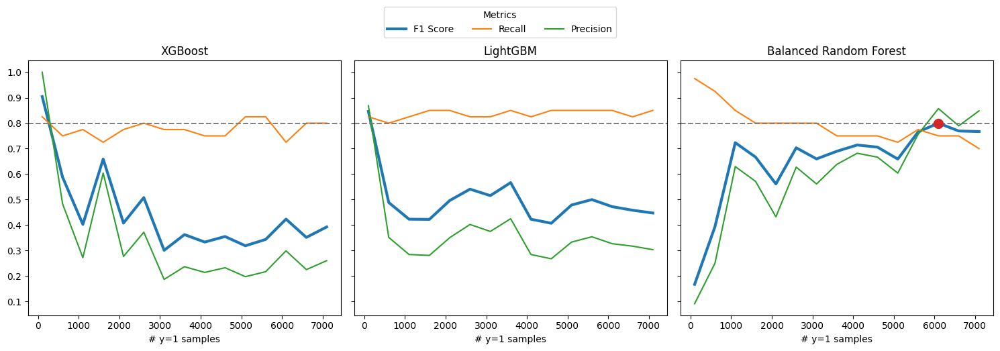
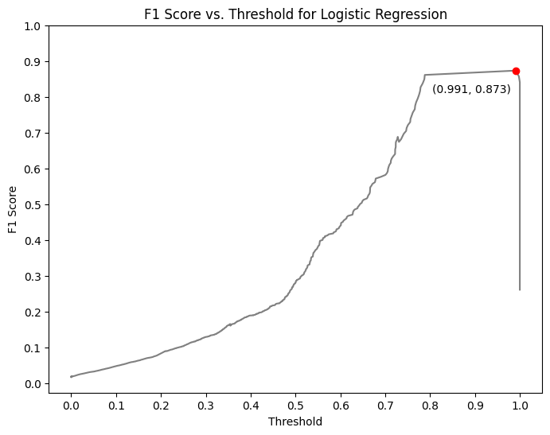

# Case Study: Rare Event Classification for Pulp-and-Paper Manufacturing Industry

## Overview

This notebook addresses a case study involving a multivariate time series dataset collected from a pulp-and-paper manufacturing process. The goal is to classify rare events—specifically, the occurrence of a paper break in the process—using the sensor data. The focus is on developing a model that provides high precision and recall for this rare event.

## Dataset Description

The dataset (`data.csv`) contains the following columns:
- **time**: Timestamps indicating when the sensor readings were taken.
- **x1 to x61**: 61 anonymized features representing sensor readings from the manufacturing process.
- **y**: The target variable indicating whether a paper break event occurred.

**Note**: The training cutoff date for the dataset is `21-05-1999`.

## Problem Statement

The task is to build a classification model to predict the paper break events (rare events) with a focus on maximizing precision and recall. Given the imbalance in the dataset, particular attention is paid to techniques that handle imbalanced data effectively.

## Approach/Process Flow

1. **Data Preprocessing**:
   - Time-based splitting: Ensure that the training data only contains records before the cutoff date of `21-05-1999`.
   - Feature scaling/normalization: Prepare the data for machine learning algorithms.
   - Handling class imbalance: Apply techniques such as SMOTE or undersampling/oversampling to address class imbalance.

2. **Modeling**:
   The following models are used for classification:
   - **Logistic Regression**: A simple linear model that can work well for binary classification problems.
   - **Balanced Random Forest**: A version of random forests that adjusts for imbalanced data by sampling the minority class.
   - **XGBoost**: A powerful gradient boosting algorithm, which can handle imbalance by weighting the classes.
   - **LightGBM**: A gradient boosting framework that is efficient and scalable, often used for large datasets, with built-in methods to handle class imbalance.

   For each model:
   - Hyperparameter tuning is performed using cross-validation or grid search.
   - Performance is evaluated on the test set using the metrics below.

3. **Evaluation**:
   - Performance metrics: Precision, Recall, F1-Score, and Confusion Matrix.
   - Special attention is paid to the precision-recall trade-off due to the rarity of the target event.

4. **Feature Importance**:
   - Identify the main drivers of the rare event (paper break) by analyzing feature importance from the trained models, particularly XGBoost and LightGBM, which provide built-in methods for feature importance ranking.

5. **Business Impact**:
   - Discuss how the findings from the model can assist in improving the manufacturing process, reduce paper break events, and enhance operational efficiency.

## Conclusion

This case study demonstrates how to handle rare event classification in industrial time-series data. The notebook outlines how to preprocess time-series data, balance classes, and train models that are tuned to handle imbalanced classification tasks effectively. The following images show the final output of the models.

